# BizExpense

**기업 출장 · 일정 · 경비 · 결재 · 정산 관리 시스템**

출장을 신청해 팀장 결재를 받고, 출장 중 일정과 경비(영수증 포함)를 기록한 뒤, 출장이 끝나면 정산을 신청해 지급까지 처리하는 사내 업무 시스템입니다.
직원 · 팀장 · 관리자 세 역할에 따라 볼 수 있는 범위와 할 수 있는 일이 다릅니다.


| | |
|---|---|
| **체험하기** | https://bizexpense-73h9.onrender.com (첫 접속 시 관리자로 자동 로그인, 무료 서버라 첫 응답에 1분 정도 걸릴 수 있음) |
| **체험 계정** | `user1`(직원) · `manager1`(팀장) · `admin`(관리자), 비밀번호 `demo1234` |
| **API 문서** | https://bizexpense-73h9.onrender.com/swagger-ui.html |

<p>
  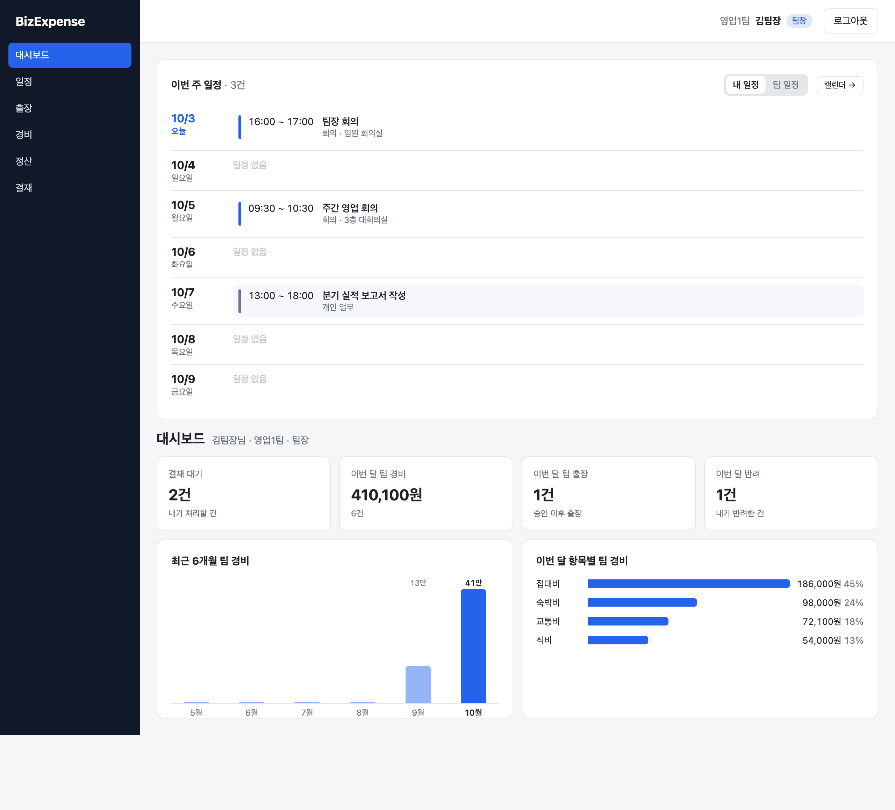
</p>

## 목차

1. [주요 기능](#주요-기능)
2. [화면](#화면)
3. [기술 스택](#기술-스택)
4. [아키텍처](#아키텍처)
5. [데이터 모델](#데이터-모델)
6. [설계 포인트](#설계-포인트)
7. [테스트](#테스트)
8. [실행 방법](#실행-방법)
9. [배포](#배포)
10. [프로젝트 구조](#프로젝트-구조)

## 주요 기능

| 영역 | 기능 |
|---|---|
| **인증 / 권한** | JWT 로그인, 역할 3단계(직원 · 팀장 · 관리자), 본인 · 같은 부서 · 전체 단위 조회 범위 |
| **일정** | 월간 / 주간 / 목록 캘린더, 팀 일정 보기, 같은 시간대 일정 충돌 검사, 출장과 연결 |
| **출장** | 임시저장 → 신청 → 승인 → 진행중 → 완료 상태 흐름, 반려 후 재신청, 취소 |
| **경비** | 출장별 경비 등록, 비용 항목 · 결제 수단(법인/개인), 검색 · 합계, 출장별 항목 요약 |
| **영수증** | 이미지 · PDF 첨부, 썸네일 미리보기, 형식(매직 넘버) · 크기 · 개수 검증 |
| **결재** | 출장 · 정산 공통 결재 구조, 결재함 / 내 신청, 승인 · 반려(사유 필수) 이력 |
| **정산** | 총 경비 − 법인카드 = 개인 지급액 자동 계산, 반려 후 재신청, 관리자 지급 처리, 중복 정산 방지 |
| **대시보드** | 이번 주 일정, 역할별 통계 카드, 최근 6개월 경비 추이, 이번 달 항목별 경비 |
| **운영** | 감사 로그(변경 요청의 수행자 · 대상 · 결과 · IP), Swagger API 문서, 기준 코드 관리 |
| **모바일** | 폰 화면 대응 (월간 달력, 하단 시트 모달, 표 가로 스크롤) |

업무 규칙 전체는 [docs/business-rules.md](docs/business-rules.md) 에 정리했습니다.

## 화면

| 출장 상세 (일정 · 경비 요약 · 정산 미리보기 · 결재 이력) | 팀 일정 캘린더 |
|---|---|
| 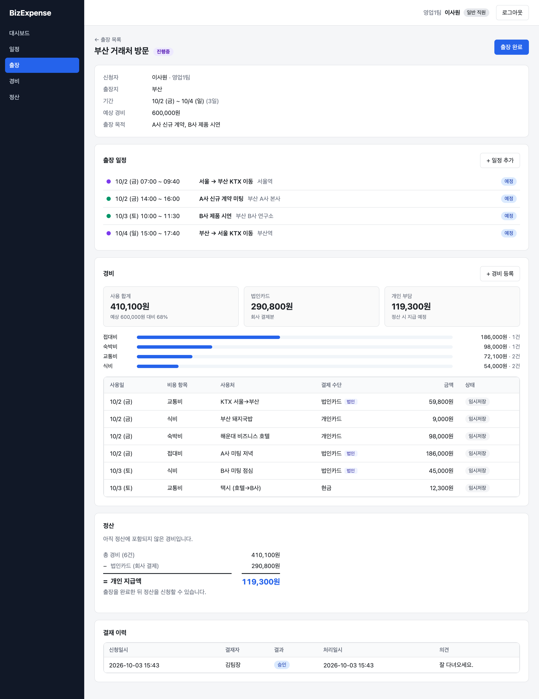 | 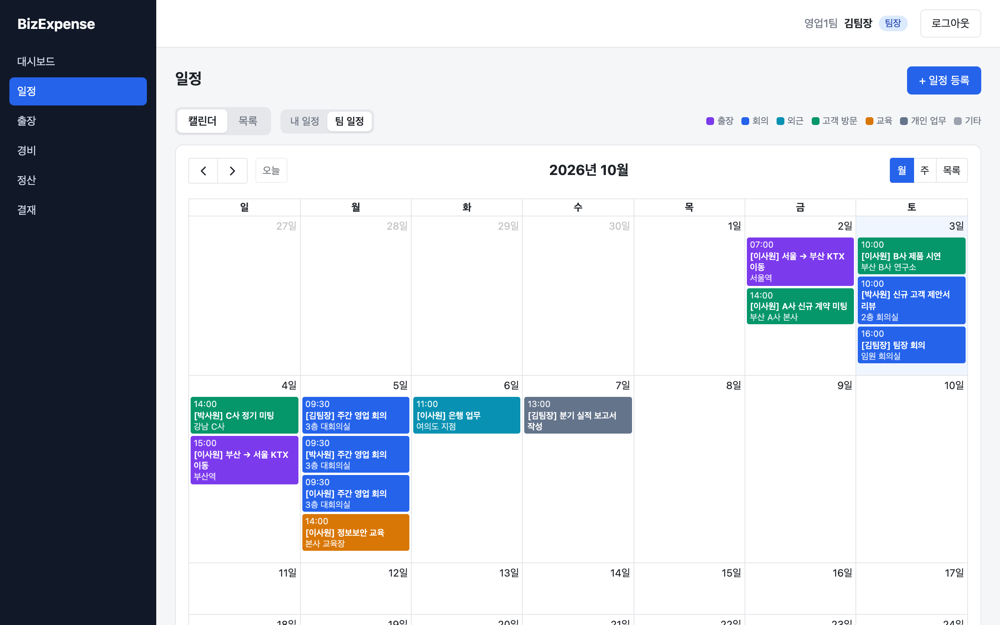 |
| **결재 (팀장 결재함)** | **경비 상세 · 영수증 첨부** |
| 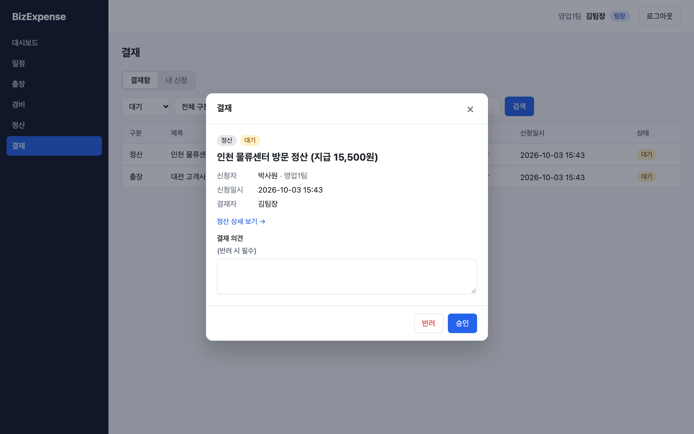 | 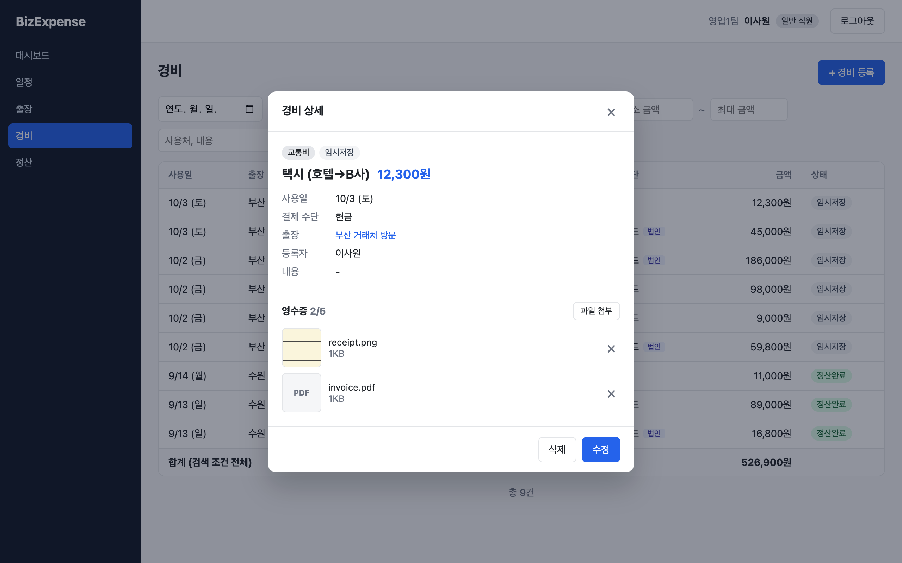 |
| **감사 로그 (관리자)** | **API 문서 (Swagger UI)** |
| 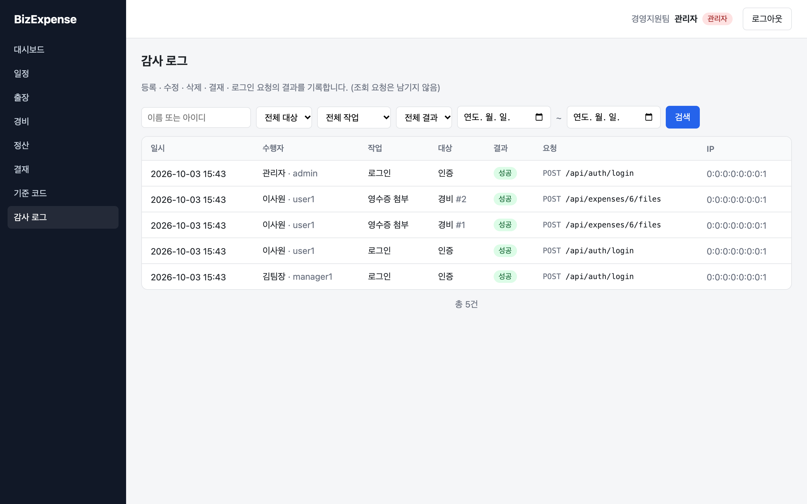 | 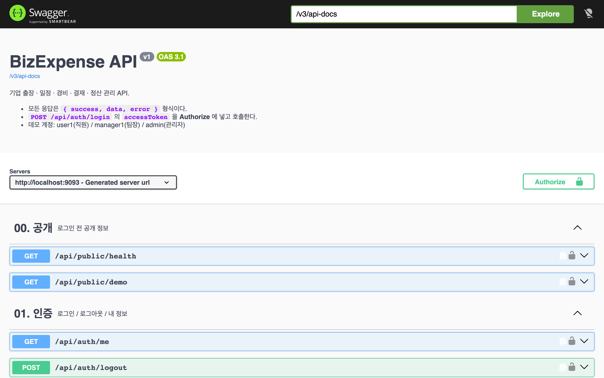 |

<p align="center">
  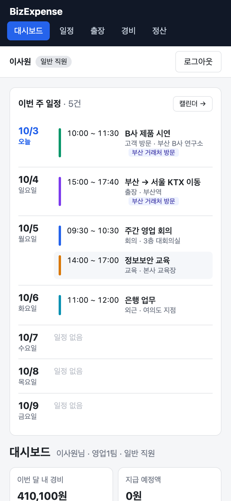
  &nbsp;&nbsp;
  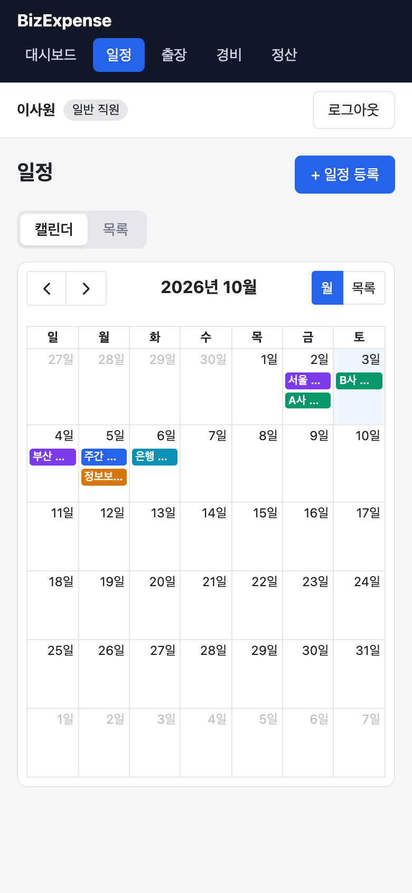
</p>

## 기술 스택

| 영역 | 기술 |
|---|---|
| Backend | Java 21, Spring Boot 4.1, Spring Security, JWT(jjwt), Spring Data JPA(Hibernate 7), Bean Validation, Spring AOP, springdoc-openapi |
| DB | PostgreSQL (운영), H2 PostgreSQL 호환 모드 (로컬 · 테스트 · 체험 서버) |
| Frontend | React 19, Vite, React Router 7, Axios, FullCalendar |
| Test | JUnit 5, Spring Boot Test, MockMvc, AssertJ, Playwright(브라우저 확인) |
| Infra | Docker(멀티 스테이지), Render(Blueprint), GitHub |

## 아키텍처

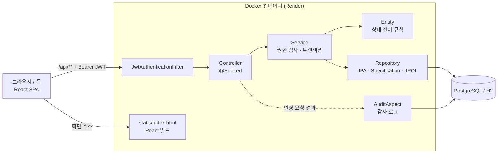

- React 빌드 결과를 Spring Boot 가 함께 서비스하는 **단일 컨테이너**입니다. 화면 주소(`/trips/1` 등)로 바로 접속해도 `index.html` 로 넘겨 React Router 가 처리합니다.
- 모든 API 응답은 같은 형식입니다.

```json
{ "success": true, "data": { } }
{ "success": false, "error": { "code": "SETTLEMENT_IN_PROGRESS", "message": "이 출장에 진행 중인 정산이 있습니다." } }
```

## 데이터 모델

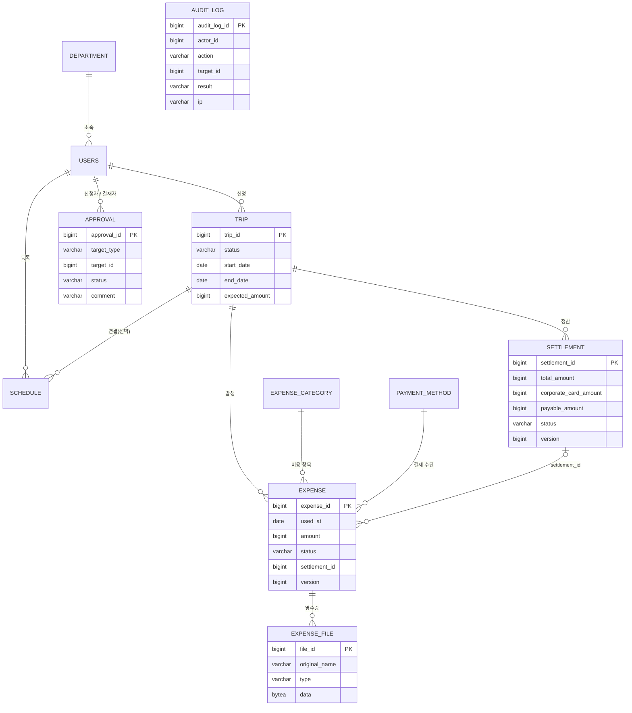

- `APPROVAL` 은 출장 · 정산을 **대상 종류 + 대상 ID** 로 가리키는 공통 결재 테이블입니다.
- `AUDIT_LOG` 는 기록 보존을 위해 다른 테이블과 외래 키 없이 값으로 저장합니다.

## 설계 포인트

### 1. 상태 전이 규칙은 엔티티가 지킨다
출장 · 경비 · 정산은 상태가 5~7개이고 상태마다 할 수 있는 일이 다릅니다. 서비스 곳곳에 `if (status == ...)` 를 흩어 두지 않고
`Trip.request()`, `Expense.requestSettlement()`, `Settlement.complete()` 같은 **엔티티 메서드가 허용 여부를 검사**하고, 어기면
`BusinessException(ErrorCode)` 를 던집니다. 덕분에 규칙을 엔티티 단위 테스트(`TripTest`, `ExpenseTest`, `SettlementTest`)로 빠르게 검증할 수 있습니다.

### 2. 결재는 하나의 공통 구조로
출장 결재와 정산 결재를 따로 만들지 않고 `Approval(대상 종류, 대상 ID)` 하나로 처리합니다. 승인 · 반려 결과를 대상 업무에 반영하는 일은
대상별 `ApprovalHandler` 구현체(`TripApprovalHandler`, `SettlementApprovalHandler`)가 맡고, **결재 처리와 같은 트랜잭션**에서 호출되어
대상 상태 변경이 실패하면 결재도 함께 롤백됩니다. 새 결재 대상이 생기면 처리기만 추가하면 됩니다.

### 3. 같은 경비가 두 번 정산되지 않게
경비는 `settlement_id` 로 한 정산에만 묶이고, 정산 대상은 "아직 정산에 들어가지 않은 임시저장 경비 + (재신청이면) 그 정산에서 반려된 경비"로 조회합니다.
두 요청이 동시에 같은 경비를 묶는 경우는 경비 · 정산의 **낙관적 락(`@Version`)** 으로 막고, 충돌은 `409 CONCURRENT_MODIFICATION` 으로 응답합니다.
출장당 진행 중인 정산은 하나로 제한합니다.

### 4. 권한은 한 곳에서
"본인 · 같은 부서 팀장 · 관리자는 조회, 본인만 변경" 규칙을 `AccessPolicy` 하나에 모았고, 목록 조회 범위는 `ViewScope(ME / TEAM / ALL)` 로
역할별 허용 여부를 검사한 뒤 `Specification` 조건으로 바꿉니다. 화면에서 버튼을 숨기는 것과 별개로 API 가 직접 막습니다.

### 5. 감사 로그는 AOP 로
변경 API 26개에 `@Audited(AuditAction.TRIP_REQUEST)` 처럼 어노테이션만 붙이면 `AuditAspect` 가 수행자 · 대상 · 결과 · IP 를 기록합니다.
업무 코드는 그대로 두고, **실패한 시도(권한 없음, 로그인 실패 등)도 오류 코드와 함께** 남깁니다. 로그 저장이 실패해도 업무 요청은 영향을 받지 않습니다.

### 6. 파일 업로드를 믿지 않기
브라우저가 보낸 Content-Type 대신 **확장자와 파일 앞부분(매직 넘버)** 이 모두 맞아야 받습니다. 내려줄 때는 `nosniff` 와 `inline` 을 붙여
이미지로 위장한 HTML 이 실행되지 않게 했습니다. 체험 서버는 재시작하면 디스크가 비워지므로 파일 내용은 DB(`bytea`)에 저장하고,
목록은 파일 내용 없이 메타 정보만 조회합니다.

### 7. 대시보드 집계
여러 도메인을 가로지르는 읽기 전용 통계라 저장소마다 메서드를 늘리지 않고 `DashboardService` 에서 JPQL 집계(`count`, `sum`, `group by year/month`)로
처리합니다. 역할에 따라 집계 범위 조건만 바꾸고, 경비가 없는 달은 0 으로 채워 6개월 추이를 만듭니다.

### 8. 환경 없이 바로 뜨는 배포
프로필을 `local`(H2 파일) · `test`(H2 메모리) · `prod`(PostgreSQL) · `demo`(체험 계정 · 예시 데이터) · `standalone`(외부 DB 없이 메모리 DB)으로 나눴습니다.
Docker 이미지 기본값이 `demo,standalone` 이라 환경변수 없이도 바로 뜨고, 재시작할 때마다 **오늘 날짜 기준** 예시 데이터로 초기화됩니다.

## 테스트

```bash
./gradlew test      # 132개
```

| 종류 | 대상 |
|---|---|
| 엔티티 단위 테스트 | 출장 · 일정 · 경비 · 정산 상태 전이와 규칙 |
| 통합 테스트 (`@SpringBootTest` + MockMvc + H2) | 인증 · 권한, 출장 결재 흐름, 일정 충돌, 경비 검색 · 합계, 영수증 업로드 검증, 정산 신청 · 반려 · 재신청 · 지급, 대시보드 집계, 감사 로그, API 문서 |
| 데모 데이터 | 체험 서버 예시 데이터가 실제 규칙을 통과하는지 |

브라우저 동작은 Playwright 스크립트로 로컬 · 배포 서버에서 직접 확인했습니다 (데스크톱 · 폰 폭).

## 실행 방법

**JDK 21** 과 Node.js 가 필요합니다.

```bash
# 백엔드 (http://localhost:8080, 기본 프로필 local: H2 파일 DB ./.data/)
./gradlew bootRun

# 프론트엔드 (http://localhost:5173, /api 는 8080 으로 프록시)
cd frontend
npm install
npm run dev
```

처음 실행할 때 데모 계정과 예시 데이터(출장 · 일정 · 경비 · 결재)를 만듭니다. 로그인 화면의 체험 계정 버튼으로 바로 로그인할 수 있습니다.

| 아이디 | 권한 | 부서 | 비밀번호 (로컬) |
|---|---|---|---|
| admin | 관리자 | 경영지원팀 | pass1234 |
| manager1 | 팀장 | 영업1팀 | pass1234 |
| user1, user2 | 일반 직원 | 영업1팀 | pass1234 |
| manager2, user3 | 팀장 / 일반 직원 | 영업2팀 | pass1234 |

- Swagger UI: http://localhost:8080/swagger-ui.html
- H2 콘솔: http://localhost:8080/h2-console (JDBC URL `jdbc:h2:file:./.data/bizexpense`)

## 배포

React 빌드 결과를 Spring Boot 가 함께 서비스하는 단일 Docker 이미지(`Dockerfile`)를 Render 에 배포합니다.
`main` 브랜치에 push 하면 자동으로 다시 배포됩니다.

| 환경변수 | 설명 |
|---|---|
| `SPRING_PROFILES_ACTIVE` | 기본 `demo,standalone`(메모리 DB). PostgreSQL 은 `prod,demo`, 실제 운영은 `prod` |
| `JWT_SECRET` | Base64, 256bit 이상 (없으면 standalone 은 기동할 때마다 임의 생성) |
| `DEMO_PASSWORD` | 체험 계정 비밀번호 (기본 `demo1234`) |
| `DB_URL` 또는 `DB_HOST` / `DB_PORT` / `DB_NAME`, `DB_USERNAME`, `DB_PASSWORD` | `prod` 프로필의 PostgreSQL 접속 정보 |

<details>
<summary>Render Blueprint 로 PostgreSQL 과 함께 만들기 / 로컬에서 운영 모드 확인</summary>

1. GitHub 에 저장소를 올린다 (`main` 브랜치).
2. [Render](https://render.com) → **New → Blueprint** → 저장소 선택 → **Apply**. `render.yaml` 이 웹 서비스와 PostgreSQL 을 함께 만든다.
3. 무료 플랜은 15분간 요청이 없으면 잠들어 첫 접속에 1분 정도 걸리고, 무료 PostgreSQL 은 30일 후 만료된다.

로컬에서 운영 모드 확인 (PostgreSQL 대신 H2):

```bash
cd frontend && npm ci && npm run build && cd ..
cp -R frontend/dist src/main/resources/static
./gradlew bootJar
SPRING_PROFILES_ACTIVE=prod,demo PORT=9090 JWT_SECRET=any-secret \
DB_URL='jdbc:h2:mem:prod;MODE=PostgreSQL;DATABASE_TO_LOWER=TRUE' DB_USERNAME=sa DB_PASSWORD= \
java -jar build/libs/app.jar
```

</details>

## 프로젝트 구조

```text
src/main/java/com/bizexpense
├── domain
│   ├── auth          로그인 / 내 정보
│   ├── user          사용자, 역할, 접근 정책(AccessPolicy)
│   ├── department    부서
│   ├── schedule      일정, 충돌 검사
│   ├── trip          출장, 상태 전이, 출장 결재 처리기
│   ├── expense       경비, 영수증 파일
│   ├── code          비용 항목 / 결제 수단
│   ├── approval      공통 결재, ApprovalHandler
│   ├── settlement    정산, 금액 계산, 정산 결재 처리기
│   ├── dashboard     역할별 통계 (읽기 전용 집계)
│   └── audit         감사 로그 (@Audited, AuditAspect)
└── global            공통 응답 · 예외 처리, JWT 보안, 설정, 데모 데이터
frontend/src
├── api               도메인별 API 호출
├── auth              로그인 상태, 자동 로그인(체험 서버)
├── components        레이아웃, 모달, 페이지네이션 등 공통
└── pages             화면 (dashboard, schedule, trip, expense, approval, settlement, admin)
docs                  업무 규칙 상세, README 화면 캡처
```

## 개발 기록

| 단계 | 내용 |
|---|---|
| 1. 기본 구조 | 공통 응답, 예외 처리, 로그, 프로필 분리 |
| 2. 로그인 / 권한 | JWT, `ROLE_USER` / `ROLE_MANAGER` / `ROLE_ADMIN` |
| 3. 출장 | CRUD, 상태 전이, 검색 · 페이징, 일정 연결, 출장 결재 |
| 4. 일정 | 월간 / 주간 캘린더, 목록 검색, 시간대 충돌 검사, 팀 일정 |
| 5. 경비 | 비용 항목 / 결제 수단 관리, 경비 CRUD, 검색 · 합계, 출장별 요약 |
| 6. 파일 | 경비 영수증 첨부 · 미리보기 · 삭제, 형식 · 크기 · 개수 검증 |
| 7. 결재 | 공통 결재 구조, 승인 / 반려 / 재신청, 결재함 · 내 신청 |
| 8. 정산 | 금액 계산, 신청 / 반려 / 재신청, 지급 처리, 중복 정산 방지 |
| 9. 대시보드 | 역할별 통계, 6개월 경비 추이, 항목별 경비, 이번 주 일정 |
| 10. 완성도 | 감사 로그, API 문서(Swagger UI), 배포, 모바일 화면 |
